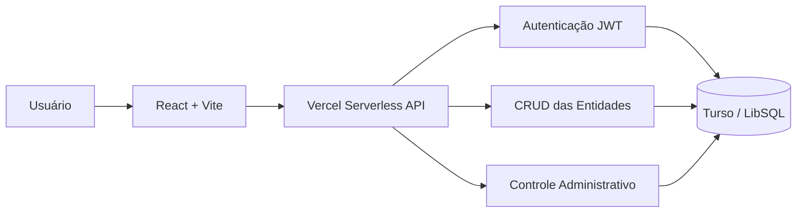
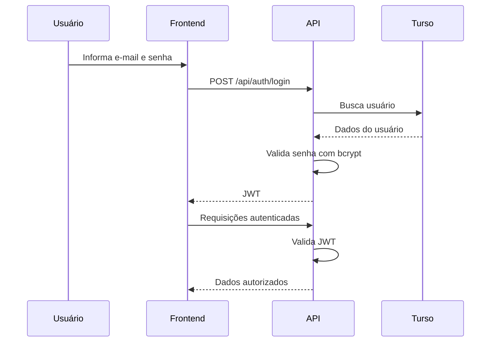

# 💸 Monvy — Gestão Financeira Pessoal Inteligente

<p align="center">
  <strong>Uma plataforma moderna para organizar, visualizar e controlar sua vida financeira em um único lugar.</strong>
</p>

<p align="center">
  Gestão de contas • Lançamentos • Cartões • Categorias • Metas • Orçamentos • Controle de usuários
</p>

---

## 📌 Sobre o projeto

O **Monvy** é uma aplicação web de gestão financeira pessoal desenvolvida para centralizar o controle das finanças de forma simples, visual e organizada.

A plataforma permite acompanhar contas, receitas, despesas, cartões de crédito, categorias, metas financeiras e orçamentos, oferecendo uma visão consolidada da situação financeira do usuário.

O sistema utiliza uma arquitetura moderna baseada em:

- **React + Vite** no frontend;
- **Vercel Serverless Functions** no backend;
- **Turso / LibSQL** como banco de dados SQL distribuído;
- autenticação baseada em **JWT**;
- controle de acesso por perfil e por tela;
- interface responsiva para desktop e dispositivos móveis.

O projeto também possui um perfil administrativo capaz de gerenciar usuários e definir individualmente quais módulos cada usuário pode acessar.

---

# ✨ Principais funcionalidades

## 📊 Dashboard financeiro

Visão consolidada das informações financeiras do usuário, permitindo acompanhar indicadores importantes da vida financeira.

A interface foi projetada para apresentar informações de forma simples e visual, utilizando gráficos, indicadores e resumos financeiros.

---

## 💳 Contas

Gerenciamento das contas financeiras utilizadas pelo usuário, como:

- conta corrente;
- conta digital;
- carteira;
- investimentos;
- outras fontes financeiras.

As contas podem ser utilizadas como origem ou destino dos lançamentos registrados no sistema.

---

## 💰 Lançamentos

Controle centralizado das movimentações financeiras.

Permite organizar registros como:

- receitas;
- despesas;
- transferências;
- movimentações financeiras vinculadas às contas;
- categorização de lançamentos.

Os lançamentos formam a base das análises financeiras apresentadas pela aplicação.

---

## 🗂️ Categorias

Organização das receitas e despesas por categorias.

Exemplos:

- Alimentação;
- Transporte;
- Moradia;
- Saúde;
- Educação;
- Lazer;
- Salário;
- Investimentos.

A categorização facilita a análise dos hábitos financeiros e da distribuição dos gastos.

---

## 💳 Cartões de crédito

Gerenciamento dos cartões utilizados pelo usuário.

O módulo permite centralizar informações relacionadas aos cartões e suas movimentações, contribuindo para uma visão mais completa das obrigações financeiras.

---

## 🎯 Metas financeiras

Criação e acompanhamento de objetivos financeiros.

Exemplos:

- reserva de emergência;
- viagem;
- compra de veículo;
- aquisição de imóvel;
- investimentos;
- pagamento de dívidas.

O objetivo é permitir que o usuário acompanhe sua evolução financeira ao longo do tempo.

---

## 📅 Orçamento

Planejamento e controle de limites financeiros.

O módulo de orçamento permite acompanhar os valores planejados em comparação com os gastos registrados, auxiliando na identificação de excessos e no planejamento financeiro.

---

## 👥 Gerenciamento de usuários

O Monvy possui dois níveis principais de acesso:

```text
admin
user
```

O administrador pode:

- visualizar todos os módulos;
- acessar o gerenciamento de usuários;
- controlar permissões;
- liberar ou bloquear telas individualmente para usuários comuns.

O gerenciamento administrativo está disponível em:

```text
/usuarios
```

---

# 🔐 Controle de acesso

O sistema utiliza controle de acesso baseado em perfil e permissões.

## Perfis

### `admin`

Possui acesso completo à aplicação.

Pode:

- acessar todas as telas;
- administrar usuários;
- definir permissões;
- visualizar módulos administrativos.

### `user`

Possui acesso apenas às funcionalidades explicitamente liberadas pelo administrador.

---

## Estrutura das permissões

No banco de dados:

```text
users.role
```

Pode assumir:

```text
admin
user
```

As telas permitidas são armazenadas em:

```text
users.allowed_screens
```

O campo utiliza uma estrutura JSON contendo as telas liberadas para determinado usuário.

Exemplo conceitual:

```json
[
  "dashboard",
  "contas",
  "lancamentos",
  "categorias",
  "cartoes"
]
```

O frontend utiliza essas permissões para controlar:

- rotas acessíveis;
- itens exibidos no menu;
- páginas permitidas ao usuário.

> O backend também deve validar as permissões sempre que uma operação exigir controle de acesso. Esconder uma tela no frontend, sozinho, não representa uma barreira de segurança.

---

# 🛠️ Tecnologias utilizadas

## Frontend

| Tecnologia | Utilização |
|---|---|
| React 18 | Construção da interface |
| Vite | Build e ambiente de desenvolvimento |
| Tailwind CSS | Estilização |
| React Router | Gerenciamento de rotas |
| TanStack Query | Cache e gerenciamento de requisições |
| Recharts | Gráficos e visualizações |
| Lucide React | Biblioteca de ícones |

---

## Backend

| Tecnologia | Utilização |
|---|---|
| Vercel Functions | API Serverless |
| Node.js | Execução do backend |
| `@libsql/client` | Comunicação com Turso |
| JSON Web Token | Autenticação |
| `bcryptjs` | Hash seguro de senhas |

---

## Banco de dados

O projeto utiliza:

**Turso + LibSQL**

O Turso fornece uma implementação distribuída e compatível com SQLite, permitindo utilizar um banco SQL hospedado na nuvem com integração simples ao ambiente serverless.

---

# 🏗️ Arquitetura

A arquitetura geral da aplicação segue o seguinte fluxo:



De forma simplificada:

```text
Usuário
   │
   ▼
React + Vite
   │
   │ HTTPS / JSON
   ▼
Vercel Serverless Functions
   │
   ├── Autenticação JWT
   ├── Controle de acesso
   ├── CRUD das entidades
   └── Administração de usuários
   │
   ▼
Turso / LibSQL
```

---

# 📁 Estrutura do projeto

```text
monvy/
│
├── api/
│   │
│   ├── _lib/
│   │   ├── banco de dados
│   │   ├── autenticação
│   │   ├── schema
│   │   ├── entidades
│   │   └── utilitários
│   │
│   ├── auth/
│   │   ├── login
│   │   ├── register
│   │   └── me
│   │
│   ├── entities/
│   │   └── [entity]/
│   │       └── CRUD genérico das entidades
│   │
│   └── admin/
│       └── users/
│           └── gerenciamento de usuários
│
├── scripts/
│   └── initDb.mjs
│
├── src/
│   │
│   ├── api/
│   │   ├── cliente HTTP
│   │   └── repositórios das entidades
│   │
│   ├── components/
│   │   ├── ui/
│   │   ├── Logo
│   │   ├── PageHeader
│   │   └── TransactionModal
│   │
│   ├── context/
│   │   ├── Auth
│   │   └── Theme
│   │
│   ├── layout/
│   │   ├── Sidebar
│   │   ├── AppLayout
│   │   └── navegação mobile
│   │
│   └── pages/
│       ├── Login
│       ├── Register
│       ├── Dashboard
│       ├── Accounts
│       ├── Transactions
│       ├── Categories
│       ├── CreditCards
│       ├── Goals
│       ├── Budget
│       ├── Users
│       ├── Settings
│       └── Placeholder
│
├── .env.example
├── package.json
├── vite.config.*
└── README.md
```

---

# ⚙️ Pré-requisitos

Antes de executar o projeto, é necessário possuir:

- Node.js;
- npm;
- conta no Turso;
- banco LibSQL/Turso criado;
- credenciais de acesso ao banco.

Para publicação:

- conta no GitHub ou GitLab;
- conta na Vercel.

---

# 🚀 Instalação

Clone o projeto:

```bash
git clone URL_DO_REPOSITORIO
```

Entre na pasta:

```bash
cd monvy
```

Instale as dependências:

```bash
npm install
```

---

# 🔑 Variáveis de ambiente

Copie:

```text
.env.example
```

para:

```text
.env
```

Configure as seguintes variáveis:

```env
TURSO_DATABASE_URL=libsql://SEU-BANCO.turso.io

TURSO_AUTH_TOKEN=SEU_TOKEN_TURSO

JWT_SECRET=UMA_CHAVE_SECRETA_LONGA_E_ALEATORIA

ADMIN_EMAIL=admin@exemplo.com

ADMIN_PASSWORD=UMA_SENHA_FORTE

ADMIN_NAME=Administrador
```

---

## Descrição das variáveis

### `TURSO_DATABASE_URL`

URL de conexão com o banco Turso.

Exemplo:

```env
TURSO_DATABASE_URL=libsql://meu-banco-minha-org.turso.io
```

---

### `TURSO_AUTH_TOKEN`

Token utilizado para autenticação da aplicação junto ao Turso.

Nunca publique esse valor.

---

### `JWT_SECRET`

Chave utilizada para assinar os tokens JWT.

Utilize uma string longa e aleatória.

Exemplo:

```text
uma-chave-com-alta-entropia-e-impossivel-de-adivinhar
```

Em produção, recomenda-se utilizar um valor gerado criptograficamente.

---

### `ADMIN_EMAIL`

E-mail utilizado para criar o usuário administrador inicial.

---

### `ADMIN_PASSWORD`

Senha inicial do administrador.

⚠️ Utilize uma senha forte em ambientes reais.

---

### `ADMIN_NAME`

Nome exibido para o administrador inicial.

---

# 🗄️ Inicialização do banco de dados

Após configurar o arquivo `.env`, execute:

```bash
npm run db:init
```

Esse comando executa:

```text
scripts/initDb.mjs
```

O processo é responsável por:

- conectar ao Turso;
- criar o schema da aplicação;
- criar as tabelas necessárias;
- configurar estruturas iniciais;
- criar o usuário administrador.

Atualmente, o schema possui **12 tabelas utilizadas pela aplicação**.

---

# 👑 Criação do administrador

Durante a inicialização do banco, o sistema utiliza:

```env
ADMIN_EMAIL
ADMIN_PASSWORD
ADMIN_NAME
```

para criar o primeiro usuário administrativo.

O administrador possui acesso completo à aplicação.

Após acessar o sistema, poderá utilizar:

```text
/usuarios
```

para administrar os demais usuários.

---

# 💻 Executando localmente

Existem duas formas principais de executar o projeto.

---

## Opção 1 — Frontend com Vite

Execute:

```bash
npm run dev
```

O frontend estará disponível normalmente em:

```text
http://localhost:5173
```

Porém, as rotas:

```text
/api/*
```

dependem das Vercel Functions.

Por isso, será necessário executar também o ambiente da Vercel.

Instale a CLI:

```bash
npm install -g vercel
```

Depois execute:

```bash
vercel dev
```

A API ficará disponível através do ambiente local da Vercel.

---

## Opção 2 — Executar tudo com Vercel Dev

A forma mais próxima do ambiente de produção é utilizar diretamente:

```bash
vercel dev
```

A aplicação normalmente ficará disponível em:

```text
http://localhost:3000
```

Esse modo executa:

```text
Frontend
+
Vercel Functions
+
Rotas /api
```

no mesmo ambiente.

---

# 🔄 Proxy da API durante desenvolvimento

Quando o frontend é executado com:

```bash
npm run dev
```

o Vite utiliza um proxy para encaminhar:

```text
/api
```

para:

```text
http://localhost:3000
```

Portanto, uma configuração comum é utilizar dois terminais.

### Terminal 1

```bash
vercel dev
```

### Terminal 2

```bash
npm run dev
```

Ou simplesmente utilizar:

```bash
vercel dev
```

para executar a aplicação completa.

---

# 🌐 API

A API está localizada em:

```text
/api
```

e é implementada utilizando **Vercel Serverless Functions**.

---

## Autenticação

Principais rotas:

```text
/api/auth/login
/api/auth/register
/api/auth/me
```

### Login

Responsável por:

1. receber as credenciais;
2. localizar o usuário;
3. verificar a senha utilizando `bcryptjs`;
4. gerar um JWT;
5. retornar as informações autenticadas.

---

### Registro

Permite a criação de novos usuários conforme as regras definidas pela aplicação.

---

### Usuário autenticado

A rota:

```text
/api/auth/me
```

permite recuperar os dados do usuário associado ao token JWT.

---

# 📦 API de entidades

O projeto possui uma estrutura genérica de CRUD localizada em:

```text
/api/entities/[entity]
```

Essa arquitetura evita duplicação excessiva de código e centraliza operações comuns.

As entidades representam recursos utilizados pelos módulos financeiros da aplicação.

Exemplos de módulos associados:

```text
Contas
Lançamentos
Categorias
Cartões
Metas
Orçamentos
```

As operações disponíveis dependem da implementação de cada entidade e das permissões do usuário.

---

# 👥 API administrativa

O gerenciamento de usuários está localizado em:

```text
/api/admin/users
```

Esses endpoints são reservados ao administrador.

Permitem operações relacionadas a:

- usuários cadastrados;
- perfis;
- permissões;
- telas autorizadas.

---

# 🔐 Autenticação JWT

O Monvy utiliza **JSON Web Tokens** para autenticação.

Fluxo simplificado:



---

# 🔒 Segurança

Algumas práticas importantes devem ser seguidas.

## Nunca faça commit do `.env`

Inclua obrigatoriamente:

```gitignore
.env
.env.local
.env.production
```

no `.gitignore`.

---

## Nunca exponha

```text
TURSO_AUTH_TOKEN
JWT_SECRET
ADMIN_PASSWORD
```

em:

- GitHub;
- README;
- código frontend;
- screenshots;
- logs públicos;
- issues.

---

## Senhas

As senhas devem ser armazenadas exclusivamente utilizando hash seguro.

O projeto utiliza:

```text
bcryptjs
```

para esse processo.

Nunca armazene senhas em texto puro.

---

## JWT

O `JWT_SECRET` deve:

- ser forte;
- possuir alta entropia;
- ser diferente entre desenvolvimento e produção;
- ser armazenado exclusivamente como variável de ambiente.

---

## Token Turso

Caso um token do Turso seja exposto:

1. revogue imediatamente o token;
2. gere uma nova credencial;
3. atualize as variáveis de ambiente;
4. faça um novo deploy.

---

# ☁️ Deploy na Vercel

## 1. Criar o repositório

Envie o projeto para:

```text
GitHub
```

ou:

```text
GitLab
```

---

## 2. Criar projeto na Vercel

Acesse a Vercel e selecione:

```text
New Project
```

Importe o repositório do Monvy.

---

## 3. Configurar o framework

Utilize:

```text
Framework Preset: Vite
```

### Build command

```bash
npm run build
```

### Output directory

```text
dist
```

---

## 4. Configurar variáveis de ambiente

Em:

```text
Settings
→ Environment Variables
```

adicione:

```text
TURSO_DATABASE_URL

TURSO_AUTH_TOKEN

JWT_SECRET

ADMIN_EMAIL

ADMIN_PASSWORD

ADMIN_NAME
```

Os campos `ADMIN_*` são principalmente utilizados durante a inicialização do banco.

---

## 5. Publicar

Execute o deploy normalmente pela Vercel.

As funções localizadas em:

```text
/api/**
```

serão transformadas automaticamente em endpoints serverless.

---

## 6. Inicializar o banco

Após configurar o Turso, execute uma vez:

```bash
npm run db:init
```

com o `.env` apontando para o banco de produção.

Isso criará:

- tabelas;
- estruturas necessárias;
- usuário administrador inicial.

---

# 📱 Responsividade

O Monvy foi estruturado para suportar diferentes tamanhos de tela.

No desktop, a navegação utiliza:

```text
Sidebar
```

Nos dispositivos móveis:

```text
Bottom Navigation
```

A interface utiliza uma identidade visual baseada principalmente em:

```text
Navy
Emerald Green
White
```

buscando transmitir:

- segurança;
- crescimento financeiro;
- tecnologia;
- clareza.

---

# 🎨 Interface

A estrutura principal da aplicação utiliza:

```text
AppLayout
Sidebar
PageHeader
Componentes UI
Modais
Gráficos
Cards financeiros
```

A biblioteca:

```text
lucide-react
```

é utilizada para os ícones.

Os gráficos são construídos principalmente com:

```text
Recharts
```

---

# ⚡ Gerenciamento de dados

O frontend utiliza:

```text
TanStack Query
```

para gerenciamento de estado assíncrono.

Isso permite recursos como:

- cache de requisições;
- atualização automática;
- controle de loading;
- tratamento de erros;
- invalidação de cache;
- sincronização entre interface e API.

---

# 📜 Scripts principais

## Instalar dependências

```bash
npm install
```

---

## Desenvolvimento

```bash
npm run dev
```

---

## Ambiente Vercel local

```bash
vercel dev
```

---

## Inicializar banco

```bash
npm run db:init
```

---

## Gerar build de produção

```bash
npm run build
```

---

# 🧪 Build local

Antes de realizar um deploy, recomenda-se executar:

```bash
npm run build
```

O processo deve gerar:

```text
dist/
```

Caso o build finalize sem erros, a aplicação está pronta para publicação.

---

# ⚠️ Solução de problemas

## API retorna erro durante `npm run dev`

Verifique se:

```bash
vercel dev
```

também está em execução.

O frontend Vite depende das funções presentes em `/api`.

---

## Erro ao conectar ao Turso

Confirme:

```env
TURSO_DATABASE_URL
TURSO_AUTH_TOKEN
```

Teste se:

- o banco existe;
- o token está válido;
- as variáveis foram carregadas corretamente.

---

## Usuário administrador não existe

Execute novamente:

```bash
npm run db:init
```

e verifique:

```env
ADMIN_EMAIL
ADMIN_PASSWORD
ADMIN_NAME
```

---

## JWT inválido

Confirme se o mesmo:

```env
JWT_SECRET
```

está sendo utilizado durante toda a execução da aplicação.

Alterar essa chave invalida tokens emitidos anteriormente.

---

# 🧭 Fluxo básico da aplicação

```text
Cadastro / Login
        │
        ▼
Autenticação
        │
        ▼
Dashboard
        │
        ├── Contas
        ├── Lançamentos
        ├── Categorias
        ├── Cartões
        ├── Metas
        └── Orçamento

Administrador
        │
        ▼
Gerenciamento de usuários
        │
        ▼
Definição de permissões por tela
```

---

# 🚀 Visão do projeto

O Monvy busca evoluir de um simples controle financeiro para uma plataforma inteligente de apoio à decisão financeira.

A arquitetura adotada permite incorporar futuramente recursos como:

- análises automáticas de gastos;
- identificação de padrões financeiros;
- alertas de despesas fora do padrão;
- previsão de fluxo de caixa;
- projeção de saldo futuro;
- acompanhamento inteligente de metas;
- recomendações personalizadas;
- categorização automática de transações;
- indicadores de saúde financeira;
- insights baseados em Inteligência Artificial.

A proposta é transformar dados financeiros em informações úteis para auxiliar o usuário a tomar decisões mais conscientes.

---

# 🗺️ Roadmap sugerido

```text
[✓] Autenticação de usuários

[✓] Controle de acesso por perfil

[✓] Gestão de contas

[✓] Gestão de lançamentos

[✓] Gestão de categorias

[✓] Gestão de cartões

[✓] Gestão de metas

[✓] Gestão de orçamento

[✓] Administração de usuários

[ ] Insights financeiros inteligentes

[ ] Previsão de despesas

[ ] Projeção de saldo futuro

[ ] Importação automática de transações

[ ] Categorização inteligente

[ ] Integração Open Finance

[ ] Assistente financeiro com IA

[ ] Notificações e alertas inteligentes

[ ] Aplicativo mobile
```

> Ajuste os itens marcados como concluídos de acordo com o estado real de implementação do projeto.

---

# 📌 Boas práticas para produção

Antes de colocar a aplicação em produção:

- utilize uma senha administrativa forte;
- gere um `JWT_SECRET` exclusivo;
- não exponha credenciais;
- configure corretamente as variáveis da Vercel;
- revise as permissões das APIs;
- valide autorização no backend;
- configure tratamento global de erros;
- implemente logs seguros;
- mantenha dependências atualizadas;
- evite retornar dados sensíveis nas respostas da API.

---

# 👨‍💻 Autor

**Vinicius de Souza Santos**

Projeto desenvolvido com foco em:

- Engenharia de Software;
- Ciência de Dados;
- Inteligência Artificial;
- Gestão financeira;
- Experiência do usuário;
- Aplicações Web modernas.

---

<p align="center">
  <strong>Monvy</strong><br>
  Controle hoje. Decida melhor amanhã. 💚
</p>


## Novidades (v2)
- **Recuperação de senha** (esqueci/redefinir por e-mail) + confirmação de e-mail obrigatória no cadastro.
- **Segurança**: rate limiting em auth, migrations versionadas (tabela Setting `migrations_applied`).
- **Escalabilidade**: índices SQL, filtros `?month=` e `?_limit/_offset` nas listas, `/api/summary` (agregação no banco), bootstrap com janela de 24 meses.
- **Faturas de cartão**: `/api/cards/invoices` gera faturas por competência (fechamento/vencimento) e paga debitando a conta.
- **Recorrência real**: lançamentos fixos mensais são materializados automaticamente (bootstrap).
- **IA**: auto-categorização por histórico, detecção de assinaturas, **Assistente conversacional (Gemini)**, previsão com sazonalidade, Simulador com validação cruzada (LOO) + intervalo de confiança.
- **Importar Extrato** OFX/CSV com categorização automática.
- **Onboarding** para novos usuários (primeira conta + categorias padrão).
- **PWA** instalável (manifest + service worker).
- **Lembretes por e-mail** (cron diário) e **relatório por e-mail**.
- **CI**: `.github/workflows/ci.yml` roda testes + build. Testes: `npm test`.

## Variáveis de ambiente (Vercel)
```
TURSO_DATABASE_URL=libsql://SEU-BANCO.turso.io
TURSO_AUTH_TOKEN=seu_token
JWT_SECRET=string_aleatoria_longa
CRON_SECRET=string_aleatoria_para_o_cron   # protege /api/cron/reminders
```
Config de e-mail (Gmail com senha de app) e chave do Gemini ficam nas **Configurações** do app (admin).

## Deploy resumido
1. `npm install` (inclui `nodemailer`).
2. `npm run db:init` uma vez (cria tabelas + admin).
3. Suba no GitHub → importe no Vercel (preset Vite) → adicione as env vars acima.
4. O cron de lembretes roda automaticamente no Vercel (definido em `vercel.json`).
