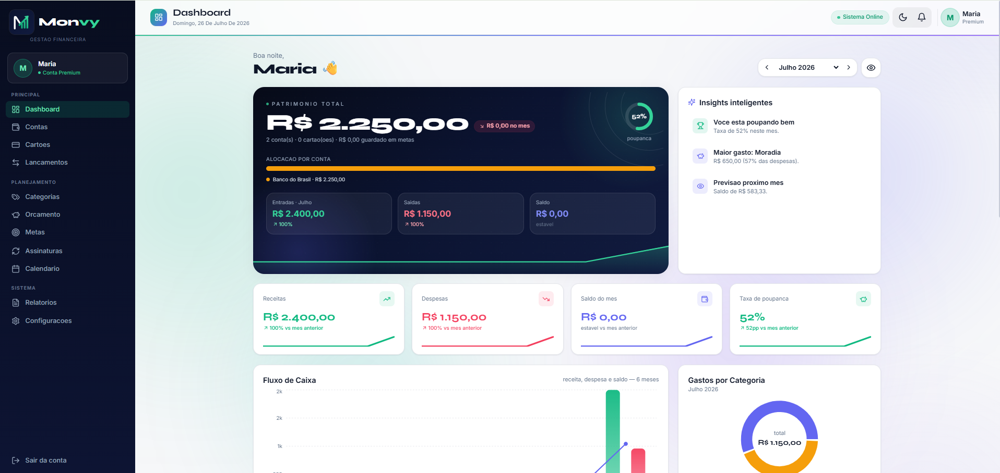
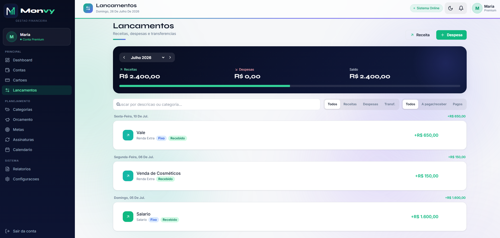
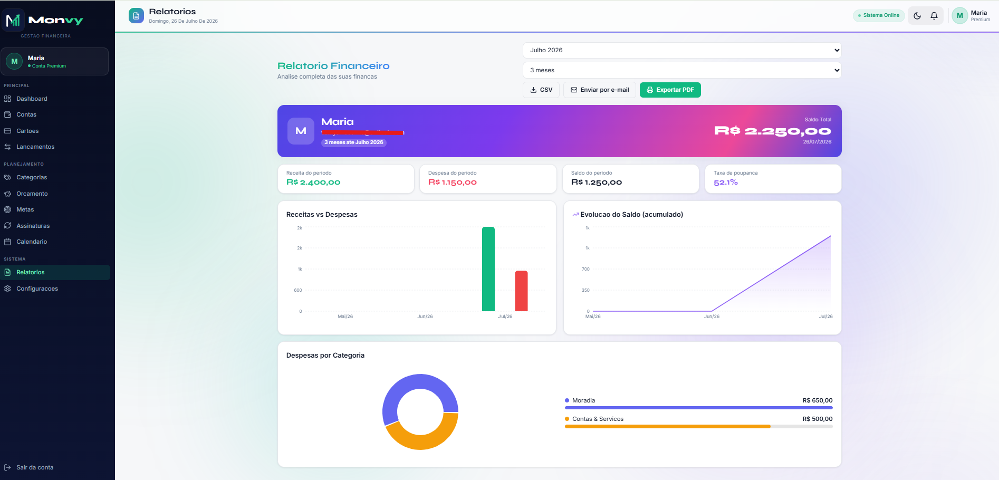
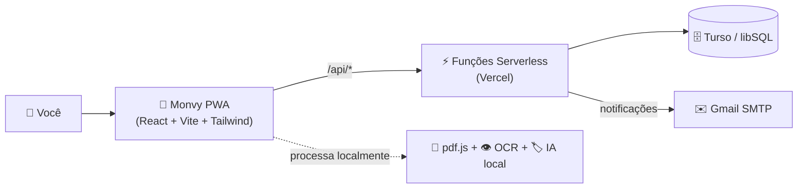

<div align="center">


# 💚 Monvy — Gestão Financeira Inteligente

**Controle suas finanças pessoais de um jeito simples, visual e inteligente.**
Contas, cartões, metas, orçamento, relatórios e IA — tudo em um só lugar. 🇧🇷

<br/>


-4FF8D2?logo=sqlite&logoColor=black)


</div>

---

## 📖 Índice
- [O que é o Monvy?](#-o-que-é-o-monvy)
- [✨ Funcionalidades](#-funcionalidades)
- [🖼️ Telas](#️-telas)
- [🧠 A parte inteligente (IA)](#-a-parte-inteligente-ia)
- [🏗️ Arquitetura](#️-arquitetura)
- [🚀 Como rodar (passo a passo)](#-como-rodar-passo-a-passo)
- [☁️ Publicar na nuvem (Vercel + Turso)](#️-publicar-na-nuvem-vercel--turso)
- [📱 Publicar nas lojas (Play Store / Microsoft Store)](#-publicar-nas-lojas)
- [🔒 Privacidade e segurança](#-privacidade-e-segurança)
- [🗺️ Roadmap](#️-roadmap)
- [👤 Autor](#-autor)

---

## 💡 O que é o Monvy?

> **Para quem não é da área:** imagine um "app do banco" só seu, onde você anota o que ganha e gasta, e ele te mostra em gráficos bonitos para onde seu dinheiro vai, quanto sobra, o que falta pagar e como melhorar. Ele até **lê a fatura do seu cartão em PDF** e organiza tudo sozinho. 💸

> **Para quem é da área:** um PWA em **React + Vite** com backend **serverless na Vercel** e banco **Turso (libSQL/SQLite na nuvem)**. Autenticação JWT, controle de acesso por tela, leitura de fatura 100% local (pdf.js + OCR), previsões com regressão linear validada por cross-validation, e integração de e-mail (Gmail). Sem depender de APIs pagas de terceiros. 🧩

---

## ✨ Funcionalidades

| Módulo | O que faz |
|---|---|
| 🏠 **Dashboard** | Visão geral: patrimônio, receitas x despesas, fluxo de caixa, gastos por categoria, projeção e insights dinâmicos. |
| 💳 **Cartões** | Cadastro de cartões, faturas por competência, uso do limite, **importar fatura em PDF (local)** e pagar fatura. |
| ↔️ **Lançamentos** | Receitas, despesas e transferências com **status "a pagar / a receber"**, recorrência, parcelamento e **anexo de comprovante**. |
| 📥 **Pagar & Receber** | Central de contas a pagar/receber: dar baixa em 1 clique, vencidos em destaque, comprovantes. |
| 🏦 **Contas** | Múltiplas contas/carteiras com saldo recalculado automaticamente. |
| 🏷️ **Categorias** | Organização de receitas/despesas com limites e cores. |
| 🐷 **Orçamento** | Limites por categoria com semáforo, medidor geral e **projeção do mês**. |
| 🎯 **Metas & Cofres** | Objetivos de economia com progresso e depósitos. |
| 🔁 **Assinaturas** | Controle de recorrências + **detecção automática** de assinaturas pelo histórico. |
| 📅 **Calendário** | Vencimentos, faturas e renovações organizados por data. |
| 🧠 **Inteligência / Saúde / Comportamento** | Score financeiro, anomalias, perfil de gastos e recomendações. |
| 🔮 **Simulador** | Projeta cenários (cortar gastos, investir…) com **Machine Learning** e intervalo de confiança. |
| ✅ **Conciliação** | Concilia entradas/saídas, acha duplicados e itens sem categoria (auto-categoriza com IA local). |
| 📊 **Relatórios** | Análise por período/mês, export **CSV/PDF** e envio por **e-mail**. |
| 🔔 **Notificações** | Sino com alertas (vencimentos, orçamento estourado, saldo negativo, anomalias). |
| ⚙️ **Configurações** | Perfil + foto, tema claro/escuro, moeda, e-mail (Gmail) e controle de acesso (admin). |

---

## 🖼️ Telas

> Coloque suas capturas em `docs/screenshots/` para elas aparecerem aqui.

| Dashboard | Lançamentos | Relatórios |
|---|---|---|
|  |  |  |

---

## 🧠 A parte inteligente (IA)

Tudo funciona **sem tokens nem APIs pagas de terceiros**:

- 📄 **Leitura de fatura (PDF):** `pdf.js` extrai o texto no próprio navegador e um parser interpreta cada compra (data, valor, parcela).
- 👁️ **OCR local:** se a fatura for escaneada/imagem, o **Tesseract.js** (WebAssembly) lê no dispositivo — nada é enviado para fora.
- 🏷️ **Auto-categorização:** um índice de frequência aprende com o seu histórico e sugere a categoria certa.
- 🔮 **Previsões (ML):** regressão linear (mínimos quadrados) com **validação cruzada Leave-One-Out** (R², MAE, RMSE reais) e banda de confiança de 95%.

---

## 🏗️ Arquitetura



**Stack:** React 18 · Vite · Tailwind CSS · React Router · TanStack Query · Recharts · lucide-react · Vercel Functions · Turso (libSQL) · JWT · bcrypt · nodemailer · pdf.js · Tesseract.js.

---

## 🚀 Como rodar (passo a passo)

> Pré-requisitos: **Node.js 20+** e uma conta gratuita no **[Turso](https://turso.tech)**.

**1. Instalar dependências**
```bash
npm install
```

**2. Configurar o ambiente** — copie `.env.example` para `.env`:
```env
TURSO_DATABASE_URL=libsql://SEU-BANCO.turso.io
TURSO_AUTH_TOKEN=seu_token
JWT_SECRET=uma_string_aleatoria_bem_longa
ADMIN_EMAIL=voce@email.com
ADMIN_PASSWORD=suasenha
ADMIN_NAME=Seu Nome
```

**3. Criar as tabelas + usuário admin**
```bash
npm run db:init
```

**4. Rodar o app** (front + API juntos, graças ao plugin de dev)
```bash
npm run dev
```
Abra **http://localhost:5173** e entre com o e-mail/senha do admin. 🎉

---

## ☁️ Publicar na nuvem (Vercel + Turso)

1. Suba o projeto para o **GitHub**.
2. Em [vercel.com](https://vercel.com) → **New Project** → importe o repositório (preset **Vite**).
3. Em **Settings → Environment Variables**, adicione:
   `TURSO_DATABASE_URL`, `TURSO_AUTH_TOKEN`, `JWT_SECRET` e `CRON_SECRET` (para os lembretes automáticos).
4. **Deploy!** As funções em `api/**` viram o backend automaticamente.
5. Rode `npm run db:init` uma vez (local, apontando para o Turso) para criar o admin.

> 💡 O app usa poucas funções serverless (consolidadas em *dispatchers*) para caber no plano **gratuito** do Vercel.

---

## 📱 Publicar nas lojas

O Monvy já é um **PWA instalável**. Use o **[PWABuilder](https://www.pwabuilder.com)** para gerar os pacotes:
- 🪟 **Microsoft Store** → pacote **MSIX**
- 🤖 **Google Play** → pacote **.aab** (TWA)

Passo a passo completo em **[STORE.md](STORE.md)**. 📦

---

## 🔒 Privacidade e segurança

- 🔑 Senhas com **bcrypt**, sessões com **JWT**, confirmação de e-mail e recuperação de senha.
- 🛡️ Rate limiting no login e controle de acesso por tela (admin define o que cada usuário vê).
- 🧾 Leitura de faturas e OCR **100% no seu dispositivo** — o arquivo não sai dele.
- 📜 Política de privacidade pública em `/privacidade` (exigida pelas lojas).

---

## 🗺️ Roadmap

- [ ] OCR de faturas totalmente offline (Tesseract self-hosted)
- [ ] Finanças compartilhadas (casal/família)
- [ ] Open Finance (conexão bancária automática)
- [ ] App iOS via Capacitor

---

## 👤 Autor

Feito com 💚 por **Vinicius Santos** — Desenvolvedor do Monvy.

<div align="center">
<sub>⭐ Se este projeto te ajudou, deixe uma estrela no repositório!</sub>
</div>
